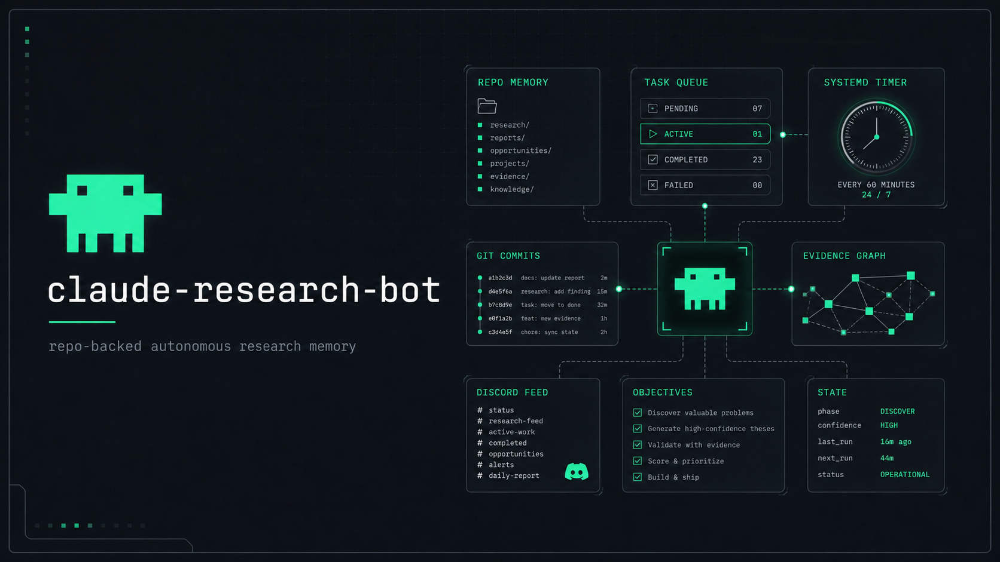

<p align="center">
  
</p>

# claude-research-bot

An **Autonomous Research Organization** that runs in bounded cycles on a VM. Claude sessions are disposable workers; this repository is the durable memory.

The system is built to survive context resets, usage limits, crashes, and reboots. Every run reconstructs state from files, completes one useful research/build cycle, records evidence, updates the queue, commits its work, and exits cleanly.

## What It Does

- Maintains repo-backed institutional memory across autonomous Claude sessions.
- Runs one bounded cycle at a time through a locked supervisor.
- Tracks work as JSON tasks in `queue/`.
- Preserves research as auditable Markdown, generated indexes, and opportunity records.
- Posts operational summaries to Discord while keeping the repo authoritative.
- Uses governance rules for evidence quality, prompt-injection handling, deduplication, and recovery.

## Runtime Shape

```text
systemd timer
  -> scripts/supervisor.sh
     -> lock + preflight + backoff
     -> claude -p prompts/bootstrap.md
        -> prompts/runtime.md
        -> research/build cycle
        -> update memory + state + queue
        -> git commit
        -> Discord summary
```

## Repository Map

| Path | Purpose |
| --- | --- |
| `MISSION.md` | Operating mandate and objective |
| `STATUS.md`, `NEXT_ACTION.md`, `COMPRESSED_CONTEXT.md` | Current handoff state |
| `TODO.md`, `DECISIONS.md`, `RESEARCH.md`, `REPORT.md` | Long-lived organizational memory |
| `state/current_state.json` | Machine-readable state used for resume |
| `queue/{pending,active,completed,failed}/` | JSON task queue |
| `research/` | Opportunity registry, findings, sources, market maps |
| `knowledge/` | Durable distilled knowledge |
| `projects/` | Promoted opportunities and build artifacts |
| `prompts/` | Bootstrap and runtime instructions |
| `rules/` | Binding quality, evidence, and injection rules |
| `scripts/` | Supervisor, queue, registry, health checks, notifications |
| `automation/` | systemd units, cron fallback, installer |
| `docs/` | Architecture, deployment, governance, evaluations |

## Quick Start

```bash
scripts/doctor.sh
scripts/supervisor.sh --dry
scripts/supervisor.sh --once
automation/install.sh
```

`doctor.sh` validates local dependencies and configuration. `supervisor.sh --dry` checks the automation path without launching Claude. `supervisor.sh --once` runs a real cycle. `automation/install.sh` installs the user-level systemd timer.

## Operating the Live Loop (start / pause / resume / stop)

The live bot runs as a self-restarting loop in the tmux session `claude-research-afk` (driven by `automation/afk_window.sh`), with `state/PAUSED` as the kill switch.

- **Start / Resume** — begin (or resume after a pause) autonomous cycles. The script auto-clears `state/PAUSED` on start, so resuming is just running it again:

  ```bash
  tmux new-session -d -s claude-research-afk "bash /home/tar/claude-research-bot/automation/afk_window.sh"
  ```

- **Pause** (graceful) — the current cycle finishes, then the loop idles and starts no new cycles; the supervisor also refuses to start while this file exists:

  ```bash
  touch /home/tar/claude-research-bot/state/PAUSED
  ```

  Deleting `state/PAUSED` alone does **not** relaunch a stopped loop — re-run the Start command.

- **Stop** (hard) — pause and kill the loop, interrupting any running cycle:

  ```bash
  touch /home/tar/claude-research-bot/state/PAUSED && tmux kill-session -t claude-research-afk
  ```

- **Status / one-off:**

  ```bash
  tmux ls                                    # is the loop alive?
  tail -f /home/tar/claude-research-bot/logs/afk_window.log
  scripts/supervisor.sh --once               # run a single cycle now (ignores backoff)
  ```

## Usage Limits & Resets

When Claude's usage/session limit is hit, the bot backs off until the quota resets, then resumes automatically. To check the exact reset time:

- **Interactive Claude Code session:** run `/usage` — shows your plan limits and when each resets.
- **From the bot's logs** (the reset Claude reported on the last limit hit):

  ```bash
  grep -h resets logs/cycle-*.log | tail -1
  # e.g. You've hit your session limit · resets 2:20am (UTC)
  ```

- **The backoff the bot is currently honoring:**

  ```bash
  jq -r '.usage_limit_until' state/current_state.json
  ```

`supervisor.sh` parses the `resets ... (UTC)` line from Claude's output and backs off to that exact instant (falling back to `limits.usage_limit_backoff_minutes` only if it cannot parse one), and `automation/afk_window.sh` sleeps until that time — so the bot resumes the moment quota returns instead of guessing a fixed hour.

## Operating Principles

- **Repo is truth.** Discord and derived memory are mirrors.
- **One cycle, one useful outcome.** Every run should leave a clean handoff.
- **Evidence before claims.** Findings must distinguish facts, likely conclusions, speculation, and unknowns.
- **No duplicate research.** New opportunities pass through the registry dedup checkpoint.
- **Full-auto needs guardrails.** The service uses locking, timeout, backoff, filesystem sandboxing, logs, and git history.

## Visual System

<p align="center">
  
</p>

The visual direction follows the local **Superuser** theme: dark charcoal surfaces, mint primary accent, terminal-grid structure, and sparse operational diagrams. The generated assets in `assets/` are intended for README and project presentation use.

## Security

Secrets belong in `config/.env` with restrictive permissions and are ignored by git. The headless run uses `--dangerously-skip-permissions`, so the systemd service constrains filesystem access with `ProtectSystem=strict`, `ProtectHome=read-only`, and explicit `ReadWritePaths`.

Rotate any token that was ever shared outside the VM before enabling unattended runs.
